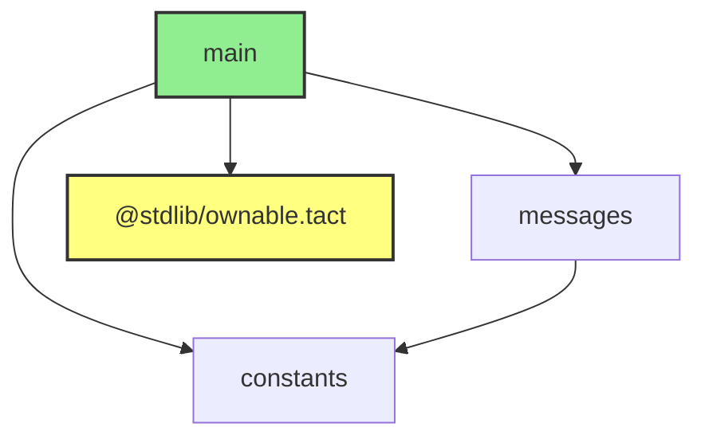

# DumpImports

Misti provides a feature to dump the **Import Graph** of your Tact code in JSON, DOT, and Mermaid formats. This tool helps you understand the dependencies between different files and modules in your project, including how contracts import each other and use the standard library.

## Usage

To dump the Import Graph in Mermaid format, use the following command:

```bash
misti -t "DumpImports:format=mmd" <TACT_CONFIG_PATH|TACT_FILE_PATH>
```

To dump the Import Graph in Graphviz DOT format, use the following command:

```bash
misti -t "DumpImports:format=dot" <TACT_CONFIG_PATH|TACT_FILE_PATH>
```

To dump the Import Graph in JSON format, use the following command:

```bash
misti -t "DumpImports:format=json" <TACT_CONFIG_PATH|TACT_FILE_PATH>
```

You can also include Tact standard library imports in the dump by adding `dumpStdlib=true` to the `DumpImports` options:

```bash
misti -t "DumpImports:format=dot,dumpStdlib=true" <TACT_CONFIG_PATH|TACT_FILE_PATH>
```

## Working with Mermaid and Graphviz

For guidance on how to work with Mermaid diagrams, Graphviz DOT files, and viewing them in Visual Studio Code, please refer to the [DumpCfg documentation](./DumpCfg.md#working-with-mermaid) and the [Graphviz section](./DumpCfg.md#working-with-graphviz).

## Understanding the Dumps

- **JSON Dumps**: Provide a detailed representation of the Import Graph in JSON format, including nodes and edges with their properties. Useful for programmatic analysis or custom tooling.

- **DOT Dumps**: Offer a visual representation of the project's import dependencies. Useful for understanding how files and contracts depend on each other.

- **Mermaid Dumps**: Similar to DOT dumps but using Mermaid syntax, which can be easier to work with in certain environments, especially when using markdown files or online editors.

By utilizing these tools, developers can gain deeper insights into the dependency structure of their Tact projects, facilitating better project organization, dependency management, and code optimization.

## Including Standard Library Imports

By default, the Import Graph excludes imports from the standard library. If you want to include standard library imports in your graph, add `dumpStdlib=true` to the command:

```bash
misti -t "DumpImports:format=mmd,dumpStdlib=true" contracts/main.tact
```

## Example

Consider a project with the following structure:

- **`main.tact`**:
```tact
import "./constants.tact";
import "./messages.tact";
import "@stdlib/ownable";
contract C{}
```

- **`constants.tact`**:
```tact
const SOMETHING: Int = 123;
```

- **`messages.tact`**:
```tact
import "./constants.tact";
message Msg { a: Bool }
```

To dump the Import Graph in Mermaid format, run:

```bash
misti -t "DumpImports:format=mmd:dumpStdlib=true" contracts/main.tact
```

The output will look like:



Which will be rendered as:


In this diagram:

- **Nodes** representing files that contain contracts are filled with green.
- **Edges** represent import relationships between files.

You can paste this Mermaid code into the Mermaid Live Editor or view it directly in VS Code with the appropriate extension.

## Interpreting the Import Graph

The Import Graph shows how files in your project are interconnected through import statements. Each node represents a file, and each edge represents an import from one file to another.

- **Nodes**:
  - Files containing contracts are highlighted (green in the examples).
  - Standard library files are highlighted differently (yellow) when included.
- **Edges**:
  - Directed edges show the import relationship (`A --> B` means `A` imports `B`).

Understanding the Import Graph can help you:

- Identify unnecessary dependencies.
- Visualize the structure of your project.

## Conclusion

By utilizing the `DumpImports` tool, developers can gain deeper insights into the dependency structure of their Tact projects, facilitating better project organization, dependency management, and code optimization.
